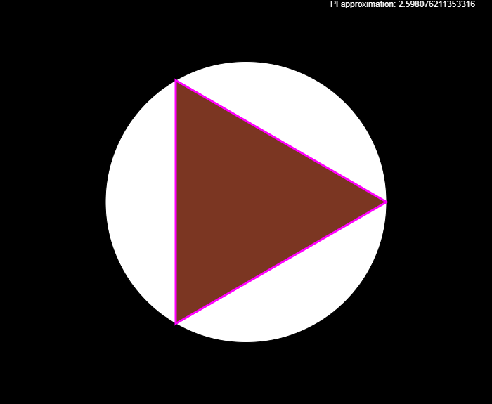
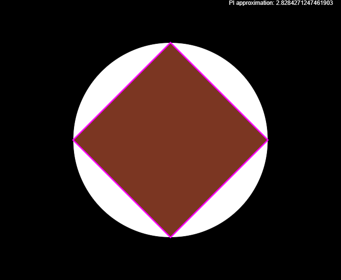
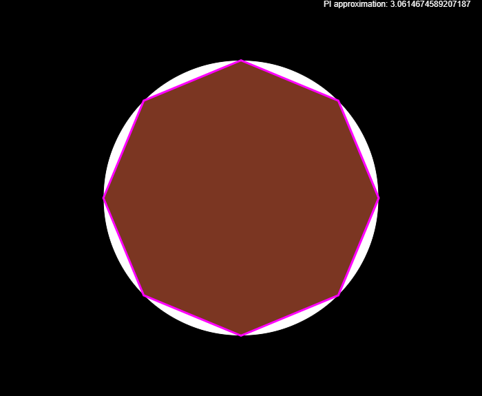
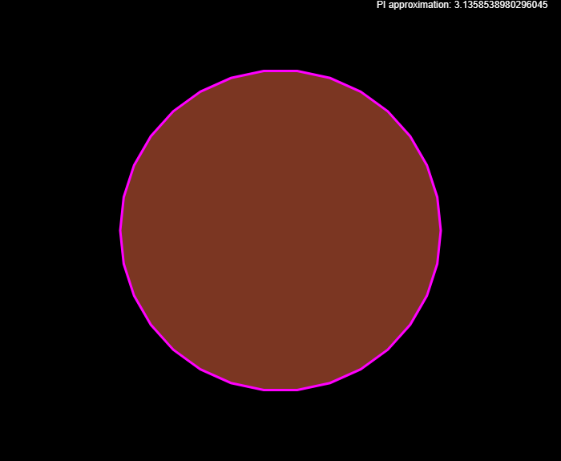

# Archimedes method for approximating PI

This concept was taken from [here](https://math.stackexchange.com/a/597825).

## How this works?

The method is really simple, even a child could come up with this method. This method was used for centuries [until Newton changed the game](https://www.youtube.com/watch?v=gMlf1ELvRzc).

### What if we filled a circle with triangles?

This question may seem silly, but if you think about it, it makes sense

Let's start by adding a Regular Triangle above an actual circle:

Lets find the circumference, as we can see, the circumference of the circle is highlighted in magenta color.

For the sake of the approximation, lets just assume this triangle is a circle.

So when we add up the sides together, we get the circumference.

We know that

$$
circumference = 2 \pi r
$$

when dividing both side by $2r$,

we get

$$
\frac{circumference}{2r} = \frac{2 \pi r}{2r}
$$

we can simplify this as:

$$
\pi = \frac{circumference}{2r}
$$

When we add up the circumference and apply the formula, we get

$$
\pi = 2.598076211353316
$$

which is obviously not true.

Lets use a regular quadrilateral(square) instead of a regular triangle.

When using a square, we get,

$$
\pi = 2.8284271247461903
$$

which still is not accurate, but closer than a reqular triangle.

Now lets use an octagon,

$$
\pi = 3.0614674589207187
$$

This is much better than that 2.82 approximation

Now let's use a 30 sided regular polygon

$$
\pi = 3.1358538980296045
$$

as we can see, this is much better.

As we crank up the number of sides, the accuracy of pi will increase.

Hope this helped you!