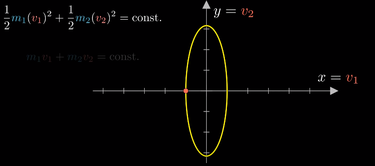
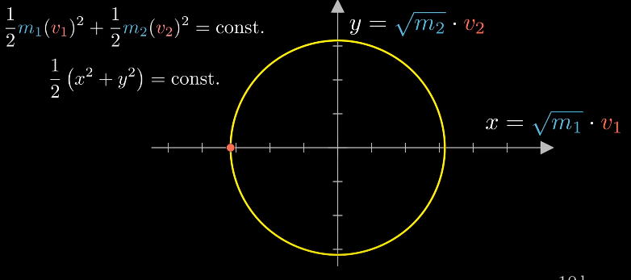
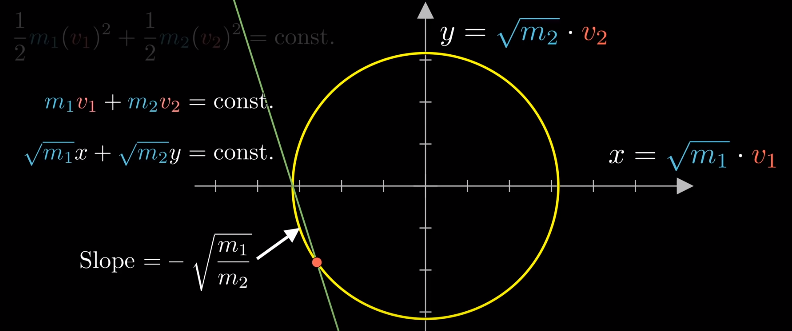
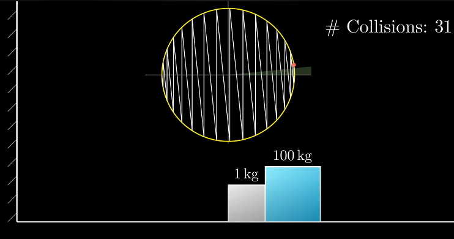

# Approximating 𝝅 using Collision

This Project was inspired by [3Blue1Brown's](https://www.youtube.com/@3blue1brown) video [Why do colliding blocks compute pi?](https://www.youtube.com/watch?v=jsYwFizhncE&ab_channel=3Blue1Brown). In this Project, I aim to learn about Euiler's integration and handling larger integers, ie integers greater than `64 bits` so I could optimize the algorithm for approximating `𝝅`.

## Basic Idea

We use the idea of inelastic collisions to approximate the value of 𝝅. When An object of mass $m$ interacts with an object of mass $m * 10^x$ and a wall of $infinite$ mass, the number of total collisions between the second body and wall will be 𝝅$10^y$, where $y=x-1$ and have $x$ digits.

## The principle

### Elastic Collision

Thie principle behind this phenomenon is explained in [Why do colliding blocks compute pi?](https://www.youtube.com/watch?v=jsYwFizhncE&ab_channel=3Blue1Brown) very well. You can watch [3Blue1Brown's](https://www.youtube.com/@3blue1brown) video to get a deeper understanding.

Although I couldn't completely understand the video, I will try to explain it as well as I could.

First let's derive the velocity of a body after elastic collision. We know that the `kinetic energy` and momentum of a body remains `constant` after elastic collision. ie,

$$
m_1v_1 + m_2v_2 = constant
$$

$$
or
$$

$$
m_1u_1 + m_2u_2 = m_1v_1 + m_2v_2--------(0)
$$

$$
and
$$

$$
\frac{m_1v_1^2}{2} + \frac{m_2v_2^2}{2}  = constant
$$

$$
or
$$

$$
\frac{m_1u_1^2}{2} + \frac{m_2u_2^2}{2} = \frac{m_1v_1^2}{2} + \frac{m_2v_2^2}{2}
$$

Where $m_n$ is the mass of the $nth$ object $u_n$ is the initial velocity of the $nth$ object and $v_n$ is the final velocity of the $nth$ object.

Multiplying the conservation of energy equation by $2$ gives:
$$
{m_1u_1^2} + {m_2u_2^2} = {m_1v_1^2} + {m_2v_2^2}
$$

Rearragning the equation of conservation of energy and momentum in such a way that the $m_1$ terms come to the `LHS` of the equation and $m_2$ terms comes to the `RHS` of the equation, we get:

$$
m_1(u_1-v_1) = m_2(v_2-u_2)--------(1)
$$

$$
and
$$

$$
m_1(u_1^2-v_1^2) = m_2(v_2^2-u_2^2)--------(2)
$$

Dividing $(2)$ by $(1) =>$

$$
\frac{u_1^2-v_1^2}{u_1-v_1} = \frac{v_2^2-u_2^2}{v_2-u_2}
$$

simplifying,

$$
u_1 + v_1 = u_2 + v_2--------(3)
$$

From $(3)$, we get:
$$
v_2 = u_1 + v_1 - u_2 --------(4)
$$

$$
v_1 = u_2 + v_2 - u_1 --------(5)
$$

Putting $(4)$ inside $(0)$ we get

$$
m_1u_1 + m_2u_2 = m_1v_1 + m_2u_1 + m_2v_1 - m_2u_2
$$

$$
m_1u_1 + m_2u_2 = v_1(m_1 + m_2) + m_2(u_1-u_2)
$$

$$
u_1(m_1-m_2) + 2m_2u_2 = v_1(m_1+m_2)
$$

$$
v_1 = \frac{u_1(m_1-m_2) + 2m_2u_2}{m_1+m_2}
$$

Similarly, we get $v_2$ as

$$
v_2 = \frac{u_2(m_2-m_1) + 2m_1u_1}{m_1+m_2}
$$

Our final Equation is

$$
V = \frac{U(M-M_o) + 2M_oU_o}{M+M_o}
$$

Where:
- $V$ is the `velocity after collision` of the object
- $U$ is the `velocity before collision` of the object
- $M$ is the `mass` off the object
- $M_o$ is the `mass` of the `other` object
- $U_o$ is the `velocity before collison` of the `other` object

### Approximating 𝝅 using the derived equation

Now, is the fun part,

If we plot the velocity of the first and second body on an $xy$ $2D$ Plane, we get a ellipse.

(image is taken from 3b1b's video)

When we plot the $velocity$ multiplied by $\sqrt{mass}$ of each body, we get a circle

(image is taken from 3b1b's video)

Here, The `radius` of the circle is dependant on the `total energy` of the system.

Conservation of energy tells, us that the $velocity$ multiplied by $\sqrt{mass}$, when plotted will move to a point in the circle. But what point?

The equation is $\sqrt{m_1}x + \$sqrt{m_2}y = constant$, which is an `equaiton of line`. Plotting the line, we can see that the line will be passing through the points of the circle, the points that the line is passing through are the `initial and final velocities` of the bodies.

(image is taken from 3b1b's video)

If we plot the lines until the velocity of both body are `positive` and the larger body has `greater velocity` we get a plot like this:

(image is taken from 3b1b's video)

The `number of points the lines pass through` indicate the digits of 𝝅 when An object of mass $m$ interacts with an object of mass $m * 10^x$ and a wall of $infinite$ mass

### Disclaimer:
The given explaination might be completely wrong, I am explaining what I understood, watch the [3b1b's Video](https://www.youtube.com/watch?v=jsYwFizhncE&ab_channel=3Blue1Brown) for a real explaination. take this explaination as a `grain of salt`