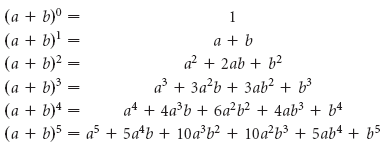

# Pascal's Triangle method by Newton

This project was inspired by [Veritasium](https://www.youtube.com/@veritasium)'s video [The Discovery That Transformed Pi](https://youtu.be/gMlf1ELvRzc).

Here he explains how [Sir Isaac Newton](https://en.wikipedia.org/wiki/Isaac_Newton) changed how $\pi$ was calculated.

## History of $\pi$

Let's understand what is $\pi$. This explaination is taken from [Veritasium video](https://youtu.be/gMlf1ELvRzc).

### What is $2 \pi r$?

Imagine we take a circular object, then we use a thread to cover it's perimeter, after marking the start and endpoint of the thread, we cut the thread from the start and endpoint. 

Now take 4 of the similar cirular objects. If we place the thread passing through the center of the circle, we can see that the thread covers 3 circles completely and almost $\frac{1}{10}$ of the fourth circle.

If we think about it, when passing through the circle, we are really passing through the diameter of the circles.

Therefore, we get that

$$
circumference = diameter*constant
$$

lets call that $constant$ as $\pi$.

Therefore

$$
circumference = diameter*\pi
$$

By definition, radius is half of pi, ie

$$
radius = 2*diameter
$$

So we can write

$$
circumference = 2*radius*\pi
$$

let $radius$ be $r$

which makes

$$
circumference = 2 \pi r
$$

We all studied that circumference of a circlue is $2 \pi r$, now we understand how it is $2 \pi r$.

### What is $\pi r^2$?

Now, we understand circumference of a circle.

Lets see how we can find the area of a circle from our knowledge.

Imageine we take the same circle and cut it up into small triangles with 1 vertex on the center and other to vertices on the perimeter of the circle. Now, we rearrange them into a rectangle.

We know that the area of a rectangle is $width*height$. So we can use that to our advantage, we know that the $height$ of the rectangle is the radius of the circle ie, $r$. We also know that the width of the rectangle is half the perimeter of the circle ie, $\frac{2 \pi r}{2} = \pi r$.

Therefore,

$$
area = \pi r * r
$$

$$
area = \pi r^2
$$

Now we understand the area of a circle.

### History
Humans knew about the area and circumference of a circle for thousands of years, practically every civilization knew it, Indians, Chineese, Europeans etc.

But the problem was they didnt knew the value of pi to a good precision.

Archimedes showed us that

$$
3.1393 < \pi < 3.1461
$$

You can understand how Archimedes did that [here](https://github.com/ivanrj7j/Pi/tree/master/Archimedes_Method_by_Ivan).

After that many mathematicians like [François_Viète](https://en.wikipedia.org/wiki/Fran%C3%A7ois_Vi%C3%A8te), [Ludolph van Ceulen](https://en.wikipedia.org/wiki/Ludolph_van_Ceulen) etc expanded on this idea using polygons with $2⁶²$ sides and found pi to almost 38 digit accuracy. It took their whole life to compute that.

## Newton's way

`Disclaimer: I can't claim that I completely understand the concept, so there will be errors, so please let me know if you find any.`

`Refer [this Veritasium video](https://youtu.be/gMlf1ELvRzc) for a more accurate explaination.`

### Binomial Theorem
Let's start with [Binomial Theorem](https://en.wikipedia.org/wiki/Binomial_theorem),

in school we all have learnt that,

$$
(a+b)^2 = a^2 + 2ab + b^2
$$

Let's see how that works,

$$
(a+b)^2 = (a+b) * (a+b)
$$

$$
(a+b) * (a+b) = a^2 + 2ab + b^2
$$

Now lets find $(a+b)^3$ in the same manner,

$$
(a+b)^3 = (a+b) * (a+b) * (a+b)
$$

$$
(a+b) * (a+b) * (a+b) = (a+b) * a^2 + 2ab + b^2
$$

which gives,

$$
(a+b) * a^2 + 2ab + b^2 = a^3 + 3a^2b + 3ab^2 + b^3
$$

If we do this continously, we get

We can see a sort of triangle emerging.

If we removed $a$ and $b$ from there, we can see a pascal's triangle emerge.

We can calculate the numbers in pascal's triangle like this:

$$
C^n_r = \frac{n!}{r! * (n-r)!}
$$

Where $n$ is the poision of the number from `top` and $r$ is the number from `left`.

So we can generalize the expansion like

$$
(a+b)^n = \sum_{r=0}^{n} C^n_r * a⁽ⁿ⁻ʳ⁾ * b^r
$$

As we can see from the image, this only apply to `Positive Integers`.

### Newton's Modifications

First Newton changed assigned
$$
a = 1
$$

$$
b = x
$$

Instead of using only poitive integers, he tried using negative integers as $n$. First he tried with $-1$

but we cant calculate the factorials of negative numbers, so he thought of a way to generalize the $C^n_r = \frac{n!}{r! * (n-r)!}$ equation.

We know that factorials are the product of all digits upto any number $i$. ie,

$$
i! = (i-0)*(i-1)*(i-2)*(i-3)*.....
$$

replacing this into equation for $C^n_r$,

$$
C^n_r = \frac{(r-0)*(r-1)*(r-2)*(r-3)*.....}{r! * (n-r)!}
$$

now lets find out $(1+x)⁻¹$

$$
(1+x)⁻¹ = \sum_{r=0}^{n} C^n_r * 1⁽ⁿ⁻ʳ⁾ * x^r
$$

$$
(1+x)⁻¹ = \sum_{r=0}^{n} (\frac{(r-0)*(r-1)*(r-2)*(r-3)*.....}{r! * (n-r)!}) * 1⁽ⁿ⁻ʳ⁾ * x^r
$$

since we know $1^j$ where $j$ is any number will always be $1$,

we get,

$$
(1+x)⁻¹ = \Sigma \frac{(n-0)*(n-1)*(n-2)*(n-3)*....*x^r}{r! * (n-r)!} 
$$

which can be written as:

$$
(1+x)⁻¹ = 1 + \frac{nx}{1!} + \frac{n(n-1)x^2}{2!} + \frac{n(n-1)(n-2)x^3}{3!} + \frac{n(n-1)(n-2)(n-3)x^4}{4!}+ ...
$$

which is:

$$
(1+x)⁻¹ = 1 + \frac{-1x}{1!} + \frac{-1(-1-1)x^2}{2!} + \frac{-1(-1-1)(-1-2)x^3}{3!} + \frac{-1(-1-1)(-1-2)(-1-3)x^4}{4!}+ ...
$$

calculating this will give us:

$$
(1+x)⁻¹ = 1 - 1x + 1x^2 - 1x^3 + 1x^4 -...+..
$$

`As we can see, if we dont have a positive integer, the expansion will have infinite terms.`

Visualizaton of what we did:

Now let's try adding fractions instead of integers for n,

let $n = \frac{1}{2}$

$$
(1+x)^\frac{1}{2} = \frac{x^0}{1} + \frac{x^1}{2} + \frac{x^2}{8} + \frac{x^3}{16} + ... 
$$

### Using Newton's Binomial Theorem to find $\pi$

First let's define what is a circle.

`Circle is a collection of points which are equidistant from a single point`

We can write this mathematically as

$$
x^2 + y^2 = r^2
$$

where $x$ and $y$ are the cartisian coordinates of a point and $r$ is the radius of the circle.

solving for $y$ in this equation,

$$
y^2 = r^2 - x^2
$$

therefore

$$
y = \sqrt{r^2 - x^2}
$$

since we want to approximate $\pi$, we take $r = 1$

therefore

$$
y =\sqrt{1 - x^2}
$$

we already found $\sqrt{(1+x)^\frac{1}{2}}$, now to solve for $y$, we just need to replace $+x$ with $-x$

which gives us

$$
(1-x^2)^\frac{1}{2} = \frac{x^0}{1} - \frac{x^1}{2} + \frac{x^2}{8} - \frac{x^3}{16} + ... - ... 
$$

If we integrate this function from 0 to 1, we get

$$
\int_0^1 (1-x^2)^\frac{1}{2} dx = \int_0^1 [\frac{x^0}{1} - \frac{x^1}{2} + ... - ...] dx
$$

###### Sorry for the stupid shading.

As we can see, integrating this would give us $\frac{1}{4}$ of the area of the circle.

We know that, $\frac{1}{4}$ area can be represented as 

$$
area = \frac{\pi r^2}{4}
$$

since $r = 1$,

$$
area = \frac{\pi}{4}
$$

therefore,

$$
\pi = area*4
$$

now is the exciting part,

we know that the area is:

$$
area = \int_0^1 [\frac{x^0}{1} - \frac{x^1}{2} + ... - ...] dx
$$

threrefore,

$$
\pi = \int_0^1 [\frac{x^0}{1} - \frac{x^1}{2} + ... - ...] dx*4
$$

applying the integration, we get

$$
\pi = 4*[x - \frac{x^3}{6} + \frac{x^4}{32}+...-...]^1_0
$$

### Optimization

For decreasing the computing time, newton integrated from 0 to 0.

and now,

